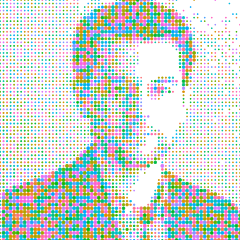

:::: {.about-banner}
::: {.about-banner-image}
{.author-image}
:::

::: {.about-banner-text}
This website was created by Rob Brotherton. I'm an academic psychologist and writer. I teach statistics and political psychology at Barnard College in New York City.
:::
::::

This site brings together some of the visualizations and games I've made for the introductory statistics course I teach. Statistical thinking is about more than abstract equations. At its core, it's about understanding the patterns and principles that shape our world. To help bring statistical ideas to life, I started creating interactive visualizations and games to help me explain key concepts to my students. My aim is to bridge the gap between the neat mathematical equations and hypothetical distributions on one hand, and the real, messy processes that somehow produce predictable patterns on the other. Seeing these processes in action goes a long way toward understanding how statistical stories play out in the world at large.

The design philosophy is grounded in the fact that statistics is a tactile, organic, and sometimes messy process. For example, I show statistical populations not as abstract curves but as hundreds of individual dots piled into a normal (or not-so-normal) distribution. When you take a sample, you can see and interact with the specific dots selected, making the leap from the individual to the aggregate more tangible. To tie it all together, I use bright colors and a "sketchy" theme that harks back to a time of hand-drawn graphs and chalkboard equations. The intention is to remind users that they are interacting not with a dry, abstract mathematical concept but with a dynamic process that reflects the vibrant, sometimes chaotic reality of our world. It's about more than numbers—it's about people, processes, and the patterns that connect them.
